# Installation of Printers in Linux Distros with CUPS

## Table of Contents
- [Installing Brother Printer on Linux](#installing_brother_printer_on_linux)
- [Getting Device Information](#getting-device-information)
  - [Example WLAN Configuration](#example-wlan-configuration)
  - [Example WLAN Report](#example-wlan-report)
  - [What Do These Tell Us?](#what-do-these-tell-us)
- [On the Linux Machine](#on-the-linux-machine)
  - [First: See if the Printer Can Be Found with the Bonjour Service](#first-see-if-the-printer-can-be-found-with-the-bonjour-service)
    - [Key Features of Bonjour (Avahi)](#key-features-of-bonjour-avahi)
    - [How to Identify if Your Printer Can Use This Auto-Configuration](#how-to-identify-if-your-printer-can-use-this-auto-configuration)
  - [Second: If Your System Cannot Run the Bonjour/Avahi Service: Try IPP or SNMP](#second-if-your-system-cannot-run-the-bonjouravahi-service-try-ipp-or-snmp)
    - [IPP](#ipp)
    - [SNMP](#snmp)
      - [Examine CUPS SNMP Configuration](#examine-cups-snmp-configuration)
      - [Access the Printer Through CUPS Admin Page](#access-the-printer-through-cups-admin-page)


# Getting device information

Instead of working with finnicky analog buttons, you can print a test report under:

```bash 
# on the main interactive panel of the printer, find:
PRINT REPORTS
# select these one at a time:
WLAN REPORT
NETWORK CONFIG
# You should now have the necessary information to proceed at your workstation
```

*This was for a Brother HL-L2350DW black and white laser printer (printer only)*

With these reports, we should have something along the lines: 

## Example WLAN configuration

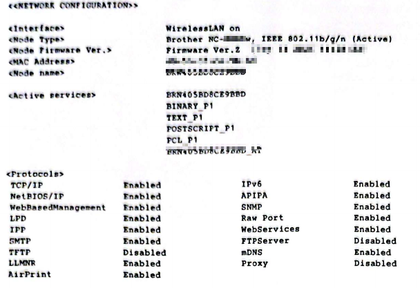

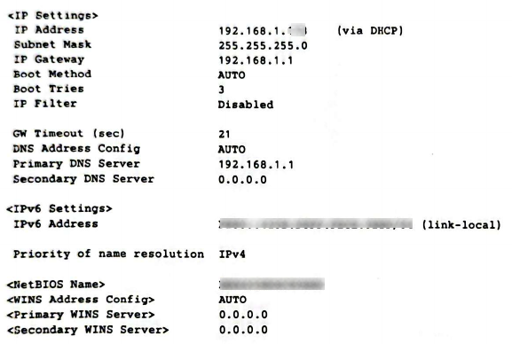

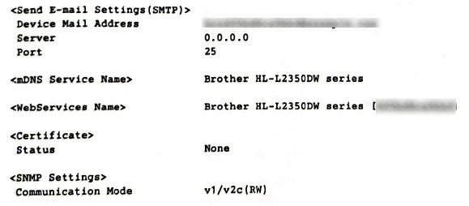

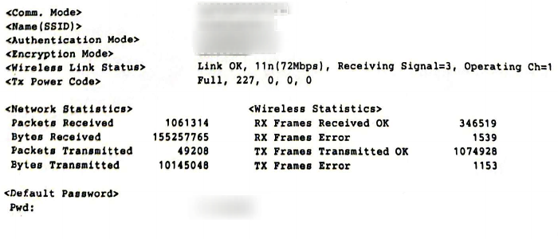


## Example WLAN report

*The top 4/5 of this page was blank*

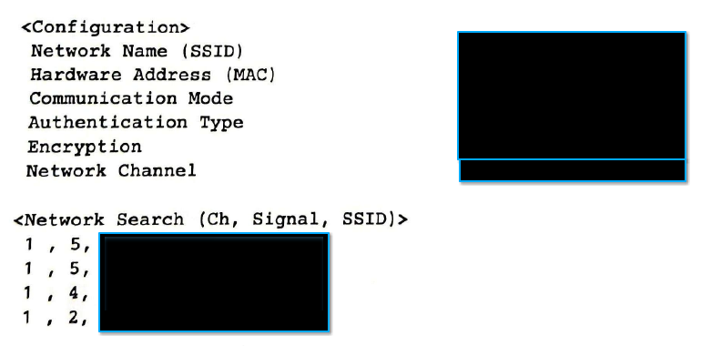

## What do these tell us?

The config is much more exhaustive than the WLAN report. The report really just gives us the name of the Wi-Fi (SSID) and the router's MAC address. But, the MAC address can be useful as layer 2 information. 

The config describes the various ports that are open on the printer, and these tell us which kinds of services the printer can participate with. 

For example:

```bash
TCP/IP = Indicates the printer can communicate using IP addresses
NetBIOS/IP = Allows Windows devices to connect over Wi-Fi
SNMP = Simple Network Management Protocol # this allows us to interact remotely
SMTP = Simple Mail Transfer Protocol # port 25 - allows sending emails
IPP = Internet Printing Protocol - allows LAN devices to send jobs to the printer 
```

TCP/IP and SNMP being enabled tells us that the printer should be able to communicate freely over our local network and can be administrated remotely; additionally, IPP being enabled allows devices to send jobs to the printer. When paired with CUPS on the linux machine, we should be able to manage our printer.

---

# On the Linux machine 

As just mentioned, we need to find a way to map the IPP-enabled printer to our Linux machine. This will be done by installing CUPS. 

If you don't have CUPS installed on your linux machine (i..e, if you press `win` and search 'print' nothing shows up), then install CUPS from console:

```bash
sudo apt update
sudo apt install cups
```

Now, you should be able to open up the webserver for cups located at:

`http://localhost:631`

But, we don't necessarily need to access this for the guide. 

CUPS can interact with a variety of protocols, but we will focus on IPP and IPPS:

```bash
IPP = 631
IPPS = 443 (same as HTTPS) # secure protocol
DNS-SD = 5353 (UDP) # typically for multicasting, mDNS
```

## First, see if the printer be found with the Bonjour service

**Bonjour** is a service developed by **Apple**, employing the use of zero-configuration networking (ZeroConf), multicast DNS (mDNS), and DNS service discovery (DNS-SD). It allows devices to discover each other and share services over a **local network** without needing a central server or manual configuration.

In Linux, **Bonjour** is implemented through mDNS  and DNS-SD,  and it is often referred to as **Avahi**, which is the open-source implementation of Bonjour.

### Key features of Bonjour (Avahi)

1. **Automatic Device Discovery** – Devices on the same network can automatically find each other (e.g., printers, shared folders, media servers).
2. **Zero-Configuration** – No need for manual IP address setup or DNS configuration.
3. **Service Discovery** – Allows discovery of services like **file sharing**, **printing**, or **media streaming** over the network.
4. **Cross-Platform** – Bonjour is used by macOS, iOS, and some Linux systems. Linux typically uses **Avahi**, which implements Bonjour protocols.

### How to identify if your printer can use this auto-configuration

To use Bonjour/Avahi for our printing purposes, we need to identify if our printer can work with DNS-SD. From the command line, we can issue a single command to figure this out:

`lpinfo --include-schemes dnssd -v`

```bash
lpinfo: lists information about available printers; provides options for installation
-v: show devices
--include-schemes: tells lpinfo we only want to search for DNS-SD; can be a list
```

If your printer supports this, you should see an output similar to mine (uuid self-obfuscated):

`network dnssd://Brother%20HL-L2350DW%20series._ipp._tcp.local/?uuid=[printers_uid]`

Here, lpinfo tells us dnssd was found for this printer and provides us with a corresponding **Uniform Resource Identifier** (URI). Similar to a URL, we use this to uniquely identify a resource on the network. 

We can now use the Bonjour/Avahi service for a quick and easy installation.

#### First: Copy the whole dnssd:

> [!tip] 
>
> all of this: 
>
> `dnssd://Brother%20HL-L2350DW%20series._ipp._tcp.local/?uuid=[printers_uid]`
>
> *copying and pasting in terminal uses:* `Ctrl + Shift + C/V`

#### Second: Issue the `lpadmin` command to add the printer

`lpadmin` permits the configuration, addition, removal, and management of printers and their settings. 

I want to:

	- Add my printer 
	- Call it 'brother_laser'
	- Enable it to accept new print jobs
	- Specify it is in my office
	- Let it use the universal driver
	- Do all of this to my specific printer 

`lpadmin -p brother_laser -E -L "office" -m everywhere -v [the_copied_dnssd_URI]`

The command and its parameters are written in the precise order I listed above. If successful, you might not even get any output after pressent `Enter`; however, if you try and print a document from your Linux machine, you should be able to see the printer listed. 

##  Second: If your system cannot run the Bonjour/Avahi service: try IPP or SNMP

### IPP

The international printing protocol (IPP) is the only protocol natively supported by CUPS and is a feature available to many modern printers. It uses port 631. From [Example WLAN configuration](## Example WLAN configuration), we did notice that IPP was enabled on the printer. Similar to searching for DNS-SD URIs, we can search for IPP ones:

`lpinfo --include-schemes ipp -v `

If you receive a similar output:

 `network ipp:[printer]`

And then you can install it likewise with `lpadmin` as above.

### SNMP

The Simple Network Management Protocol lets an admin remotely manage network devices and operates on port 161. For this one, we need to open up a file and enable SNMP discovery of local devices. 

#### 1. Examine CUPS SNMP configuration

`sudo nano /etc/cups/snmp.conf`

Here, you want to make sure the following lines are present:

```bash
Address @LOCAL
Community public
```

For me, these were present just below the header:

```bash
#
# SNMP configuration file for CUPS.  See "man cups-snmp.conf" for a complete
# description of this file.
#

Address @LOCAL
Community public
```

Once these two lines are present, you can save the changes and leave nano:

```
1. Ctrl + x
2. y
3. Enter
```

#### 2. Access the printer through CUPS admin page

In your browser, we will connect to the CUPS administration page located:

`http://localhost:631`

If you are on the CUPS admin page, you should have a site that looks like this:

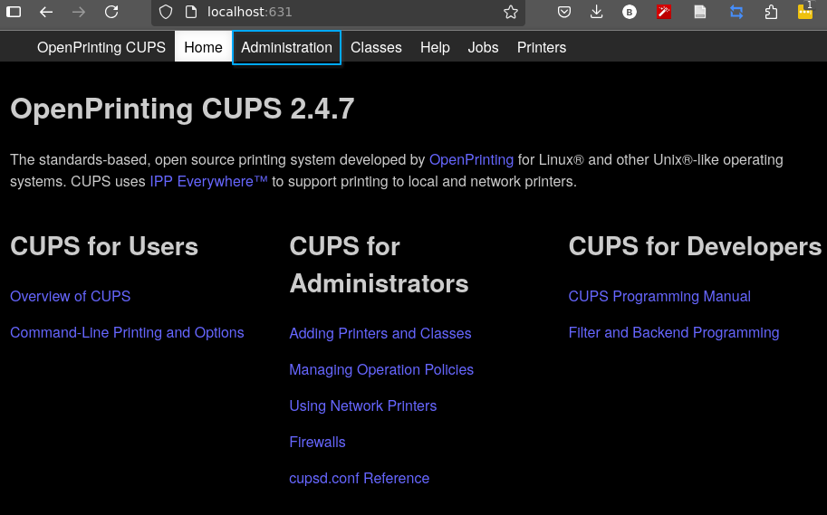

Click on the highlighted 'Administration' tab to be brought to where SNMP will function to find devices:

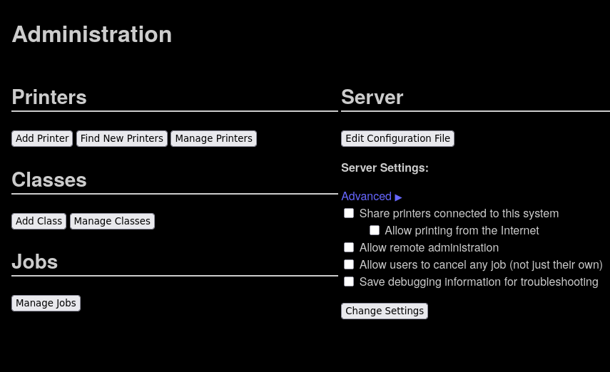

Click `Find New Printers` and wait for SNMP to find available printers:


When you add the printer, you can manually input device information just as `lpadmin` would:

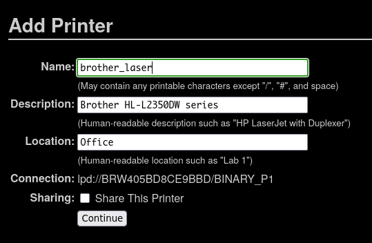

Next, it will ask you for your printer's `make`. I selected `Generic` because we'll use IPP or SNMP.

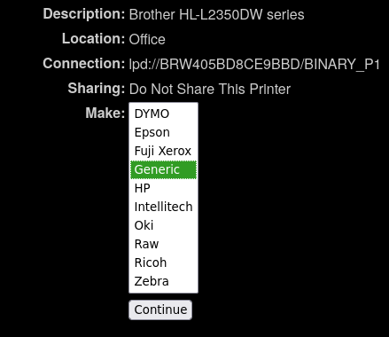

And then you select the `Model` and issue `Add Printer`

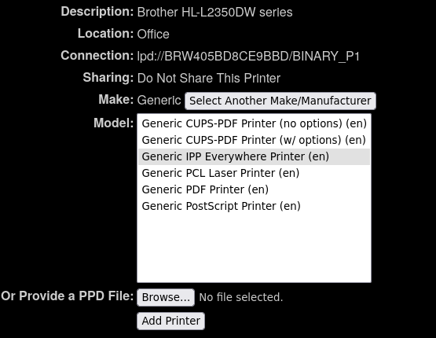

##### Use with printer Make

Similarly, if I used the `Brother` make, we can get the specific `Model`:

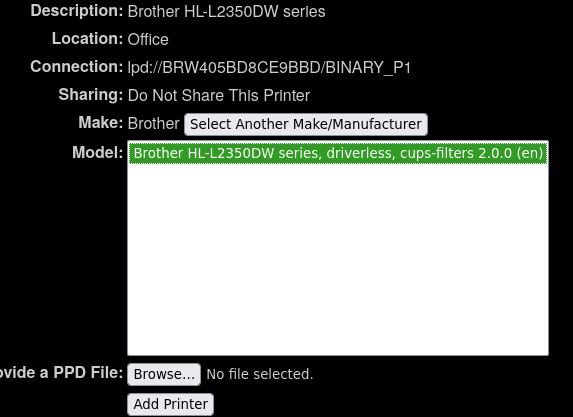

And then, you can set some default options for the machine like defaulting to 2-sided printing:

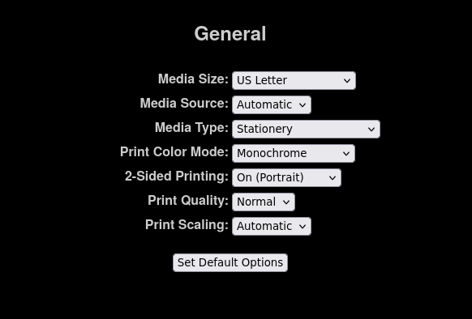

### Return to the Administration page and enter manage printers

Your printer should now be listed as mine is:


*Mine was labeled as brother_laser_test because I already used Bonjour/Avahi to add brother_laser*

**Congratulations! **

If everything followed the similar inputs/outputs as directed in this document, your printer should now be accessible to your Linux machine. 
